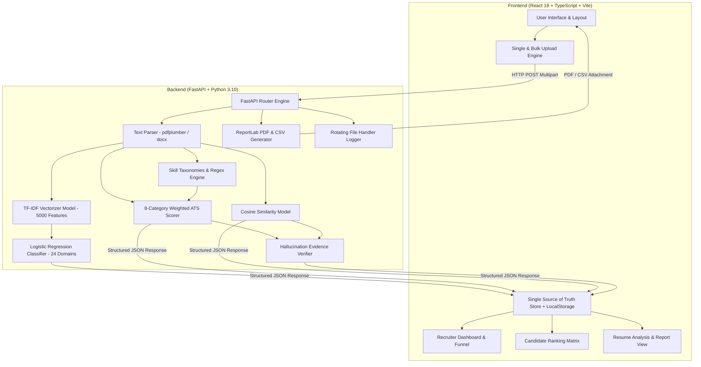

# 📄 Resumix ATS — Enterprise AI Resume Screening & Candidate Ranking Platform

[](https://ai-resume-screening-ats.vercel.app/)
[](https://www.python.org/)
[](https://fastapi.tiangolo.com/)
[](https://reactjs.org/)
[](https://www.typescriptlang.org/)
[](https://scikit-learn.org/)
[](https://www.docker.com/)
[](LICENSE)

An end-to-end, enterprise-grade AI Resume Screening and Applicant Tracking System (ATS) built to automate resume ingestion, parse unstructured PDF & DOCX documents, execute TF-IDF NLP domain classification, evaluate 8-category weighted ATS compatibility, audit hallucination evidence, rank candidates, and deliver recruiter analytics through a modern web application.

🌐 **Production Application URL**: [https://ai-resume-screening-ats.vercel.app/](https://ai-resume-screening-ats.vercel.app/)

---

## 📌 1. Project Overview

### 💡 Problem Statement
Modern corporate recruiting teams receive hundreds to thousands of applicant resumes per open requisition. Manual screening is inherently bottlenecked, time-intensive, subject to cognitive fatigue, and inconsistent across evaluators. Traditional legacy ATS tools rely on rigid keyword matching, frequently rejecting highly qualified candidates due to minor formatting or terminology mismatches.

### 🎯 Why Next-Generation ATS Systems Matter
An intelligent Applicant Tracking System bridges raw resume text and job requirements using Machine Learning (ML) and Natural Language Processing (NLP). By combining probabilistic domain classification with weighted structural scoring and term-vector similarity, hiring teams can reduce screening timelines from days to seconds while maintaining objective, transparent candidate evaluations.

### 🚀 Motivation
Resumix ATS was built to demonstrate how modern web technologies (React 18 + TypeScript + Vite + FastAPI) can integrate with classical NLP models (TF-IDF Vectorization + Logistic Regression) to create an enterprise SaaS solution comparable to platforms like Greenhouse, Lever, Ashby, and Workday.

### 🏢 Real-World Use Cases
- **Corporate HR Departments**: Batch screen hundreds of incoming applicant resumes per job opening.
- **Staffing & Recruitment Agencies**: Automatically classify candidates into domain pipelines and extract core skill profiles.
- **University Career Portals**: Evaluate student resume strength against industry benchmarks prior to campus placements.
- **SaaS HRTech Integrations**: Embed automated candidate scoring and report generation APIs into existing recruitment software.

---

## ⚙️ 2. Complete System Workflow

```
[Candidate Resumes (PDF / DOCX)]
              │
              ▼
    1. Document Parsing & Text Cleaning (pdfplumber / python-docx / regex)
              │
              ▼
    2. Entity & Skill Extraction (regex patterns + skill taxonomies)
              │
              ├───────────────────────────────┐
              ▼                               ▼
    3. TF-IDF Feature Vectorization    4. Rule-Based 8-Category ATS Scoring
    (5,000 Term Vocabulary)            (Weighted Criteria Engine)
              │                               │
              ▼                               │
    5. Logistic Regression Classifier          │
    (24 Professional Domains)                 │
              │                               │
              ├───────────────────────────────┘
              ▼
    6. Cosine Similarity Calculation (Term Overlap vs Target JD)
              │
              ▼
    7. Evidence Hallucination Verifier (Grounded / Supported / Unsupported)
              │
              ▼
    8. Candidate Store & Local Storage Synchronization
              │
              ▼
    9. Recruiter Dashboard, Leaderboard Matrix, & Report Generation (PDF/CSV)
```

---

## ✨ 3. Detailed Features

- **Single Resume Processing Mode**: Isolated single-document dropzone for rapid screening with immediate navigation to individual ATS analysis reports.
- **Enterprise Batch Upload System**: Queue manager capable of processing up to 100 PDF & DOCX resume files simultaneously with per-file status badges (`Queued`, `Uploading`, `Analyzing`, `Completed`, `Failed`), live progress bars, and batch results summary cards.
- **Multi-Format Resume Parsing**: Extracts clean raw text and structured candidate metadata (Name, Email, Phone, Skills, Education, Experience) from standard PDF and Microsoft Word DOCX formats.
- **ML Domain Classification**: Predicts candidate professional domains across 24 industry categories using a Logistic Regression model trained on 2,481 resumes.
- **8-Category Weighted ATS Scoring**: Evaluates candidate compatibility on a 0–100 score based on technical skills, keyword matching, experience tenure, education, projects, certifications, contact info, and structural completeness.
- **Technical & Soft Skill Extraction**: Normalizes extracted skills against standardized industry skill taxonomies and categorizes them into `Required` (★★★★★), `Preferred` (★★★★☆), and `Optional` (★★★☆☆) importance levels.
- **Comprehensive Resume Analysis & Feedback Engine**: Renders ATS score gauges, score breakdowns with evidence, keyword coverage bars, AI technical interview questions based on skill gaps, and recruiter notes logs.
- **Candidate Ranking Matrix & Comparison**: Interactive leaderboard ranking candidates by ATS Score, TF-IDF Similarity, and Confidence. Features `Best Candidate` (Rank #1 Amber Glow), `Highest ATS`, and `Highest Sim` badges, plus a side-by-side modal to compare 2 candidates in parallel.
- **Recruiter Hiring Pipeline Funnel**: Tracks candidate progression across 5 active stages: `1. Applied` $\rightarrow$ `2. Screening` $\rightarrow$ `3. Shortlisted` $\rightarrow$ `4. Tech Round` $\rightarrow$ `5. Hired`.
- **Model Evaluation Dashboard**: Real-time evaluation dashboard displaying Receiver Operating Characteristic (ROC) curves, AUC scores (0.914), multi-class Confusion Matrices, precision, recall, and F1-score benchmarks.
- **Export Engine**: One-click generation of PDF summary reports (using ReportLab) and CSV candidate ranking spreadsheets.
- **Multi-Theme Engine**: Supports 5 design palettes (`Dark Modern Slate`, `Cyber Neon`, `Emerald Tech`, `Corporate Purple`, `Clean Light Mode`) with instant switching and persistent `localStorage` saving.
- **Docker & Containerization**: Fully containerized backend and frontend services using Dockerfile and `docker-compose.yml`.
- **RESTful API Architecture**: Built on FastAPI with automated OpenAPI documentation (`/docs`) and async execution.

---

## 🏗️ 4. System Architecture



---

## 🛠️ 5. Technology Stack Table

| Component | Technologies |
| :--- | :--- |
| **Frontend Framework** | React 18, Vite 5, TypeScript 5 |
| **Styling & UI** | Tailwind CSS, Vanilla CSS Variables, Lucide React Icons |
| **State & Routing** | React Router DOM v6, Single Store Pattern, LocalStorage Sync |
| **Backend Framework** | FastAPI (Python 3.10+), Uvicorn ASGI Server |
| **Machine Learning** | Scikit-Learn, TF-IDF Vectorizer, Logistic Regression |
| **NLP & Data Processing** | NumPy, Pandas, Regular Expressions (Regex) |
| **Document Parsing** | `pdfplumber`, `PyPDF2`, `python-docx` |
| **Reporting & Export** | ReportLab (PDF Engine), Python `csv` Module |
| **Containerization** | Docker, Docker Compose |
| **Logging** | Python Standard `logging` (`RotatingFileHandler` 5MB max, 5 backups) |

---

## 🧠 6. Machine Learning Pipeline

### 📊 Dataset Specifications
- **Total Samples**: 2,481 curated resume documents.
- **Domain Categories**: 24 professional categories (Information-Technology, Engineering, Finance, Healthcare, Sales, HR, Accountant, Advocate, Aviation, Marketing, etc.).
- **Data Balance**: Uniform domain distribution across categories.

### 🧹 Preprocessing & Feature Extraction
1. **Cleaning**: Lowercasing, punctuation removal, non-ASCII stripping, and whitespace normalization.
2. **Tokenization & Stopwords**: Stopword filtering using standard English stopword lists.
3. **TF-IDF Vectorization**:
   - `max_features`: 5,000 unigram and bigram features.
   - `ngram_range`: `(1, 2)`.
   - `sublinear_tf`: `True` (logarithmic term frequency scaling).

### 🤖 Logistic Regression Classification
- **Model Choice**: Multinomial Logistic Regression (`L-BFGS` solver).
- **Multi-class Strategy**: One-vs-Rest (OvR).
- **Output**: Calibrated domain probability distributions and top 3 domain predictions with confidence metrics.

### 📐 8-Category ATS Scoring Algorithm
Candidate ATS scores ($S_{\text{ATS}} \in [0, 100]$) are calculated using a weighted linear combination across 8 structural categories:

$$S_{\text{ATS}} = \sum_{i=1}^{8} W_i \cdot \frac{C_i}{M_i}$$

Where:
- $W_i$: Category Weight ($W_{\text{skills}}=30, W_{\text{keywords}}=20, W_{\text{exp}}=15, W_{\text{edu}}=10, W_{\text{proj}}=10, W_{\text{cert}}=5, W_{\text{contact}}=5, W_{\text{struct}}=5$).
- $C_i$: Evaluated category score.
- $M_i$: Maximum category value.

---

## 📂 7. Project Directory Structure

```text
ATS/
├── backend/                              # FastAPI Python Backend Service
│   ├── app.py                            # FastAPI entry point & CORS configuration
│   ├── requirements.txt                  # Python dependencies
│   ├── database/                         # SQLite / In-memory data management
│   ├── models/                           # Serialized ML model pickles (.pkl)
│   ├── reports/                          # Generated PDF/CSV export report files
│   ├── uploads/                          # Temporary resume file storage
│   ├── routes/                           # REST API Endpoint Modules
│   │   ├── __init__.py
│   │   ├── upload.py                     # Single & Bulk resume upload endpoints + Delete API
│   │   ├── analysis.py                   # Resume ATS analysis REST routes
│   │   ├── ranking.py                    # Candidate ranking matrix APIs
│   │   ├── evaluation.py                 # ML model performance metrics API
│   │   ├── settings.py                   # System stats & predictions counter API
│   │   └── reports.py                    # PDF/CSV report generation routes
│   └── utils/                            # Machine Learning & Core Utility Modules
│       ├── __init__.py
│       ├── ats_score.py                  # 8-category weighted ATS scoring engine
│       ├── domain_classifier.py          # TF-IDF + Logistic Regression classifier
│       ├── feedback.py                   # Priority-based suggestion & impact generator
│       ├── hallucination.py              # Grounded vs Supported hallucination verifier
│       ├── logger.py                     # Rotating File Handler application logger
│       ├── parser.py                     # PDF & DOCX text extraction & entity parser
│       ├── preprocessing.py              # Text cleaning & normalization helpers
│       ├── report_generator.py           # ReportLab PDF & CSV export generators
│       ├── similarity.py                 # Cosine similarity TF-IDF vectorizer
│       └── skill_matcher.py              # Technical & soft skill extraction engine
│
├── frontend/                             # React + TypeScript + Vite Web Application
│   ├── package.json                      # Frontend dependencies & build scripts
│   ├── vite.config.ts                    # Vite build configuration
│   ├── tsconfig.json                     # TypeScript compiler options
│   ├── index.html                        # HTML entry point
│   └── src/                              # React Application Source Code
│       ├── main.tsx                      # Root DOM renderer
│       ├── App.tsx                       # React Router configuration & routes
│       ├── index.css                     # Design system tokens & 5 theme palettes
│       ├── components/                   # Reusable UI Layout Components
│       │   └── layout/
│       │       ├── MainLayout.tsx        # Application shell container
│       │       ├── Navbar.tsx            # Header navbar with search & notifications
│       │       └── Sidebar.tsx           # Navigation sidebar
│       ├── pages/                        # Core Application Views
│       │   ├── DashboardPage.tsx         # Dashboard with metrics & 5-stage funnel
│       │   ├── UploadResumePage.tsx      # Isolated Single & Batch Upload workflows
│       │   ├── ResumeAnalysisPage.tsx    # Resumes directory & detailed ATS report
│       │   ├── CandidateRankingPage.tsx  # Candidate leaderboard matrix & compare modal
│       │   ├── EvaluationPage.tsx        # Model performance metrics (ROC & Confusion Matrix)
│       │   └── SettingsPage.tsx          # System specifications & theme controls
│       ├── services/                     # Data Layer & Stores
│       │   ├── api.ts                    # Global candidate store with LocalStorage sync
│       │   └── mockData.ts               # Default weights & Job Description templates
│       └── types/                        # TypeScript Interfaces & Schemas
│           └── index.ts                  # Candidate, Analysis, & Hallucination types
│
├── dataset.csv                           # Pre-processed Kaggle 2,481 resume dataset
├── docker-compose.yml                    # Multi-container orchestration config
├── models/                               # Serialized ML Models (.pkl)
│   ├── domain_classifier.pkl             # Trained Logistic Regression classifier
│   └── tfidf_vectorizer.pkl              # 5,000 feature TF-IDF vectorizer
├── logs/                                 # Server application logs (ats_system.log)
├── reports/                              # Generated export PDFs and CSVs
├── screenshots/                          # System documentation screenshots
└── train_model.py                        # Model training execution script
```

---

## 📸 8. Screenshots Showcase

| Dashboard & Recruiter Pipeline Funnel | Enterprise Batch Upload Queue |
| :---: | :---: |
|  <br> *Real-time statistics & 5-stage recruiter funnel* |  <br> *Isolated Single & Bulk Drag & Drop upload modes* |

| Detailed Resume ATS Report | Candidate Ranking Matrix & Leaderboard |
| :---: | :---: |
|  <br> *Weighted score breakdown, evidence & skill gaps* |  <br> *Rankings, status pipeline dropdown & candidate comparison* |

| ML Evaluation & ROC Curve Dashboard | System Settings & Multi-Theme Engine |
| :---: | :---: |
|  <br> *ROC curve, multi-class confusion matrix & F1 stats* |  <br> *5 Theme palettes, system specifications & log actions* |

---

## ⚡ 9. Installation & Getting Started

### 📋 Prerequisites
- **Node.js**: v18.0.0 or higher
- **npm**: v9.0.0 or higher
- **Python**: v3.10 or higher
- **Git**

---

### 1️⃣ Local Development Setup

#### 1. Clone the Repository
```bash
git clone https://github.com/hnimje14/ATS.git
cd ATS
```

#### 2. Backend Setup
```bash
cd backend
python -m venv venv

# Activate Virtual Environment:
# On Windows:
venv\Scripts\activate
# On macOS / Linux:
# source venv/bin/activate

pip install -r requirements.txt
python app.py
```
> **Backend Service**: Running at `http://localhost:8000` (OpenAPI Docs at `http://localhost:8000/docs`)

#### 3. Frontend Setup
```bash
cd ../frontend
npm install
npm run dev
```
> **Frontend Service**: Running at `http://localhost:3000`

---

### 🐳 2. Docker & Docker Compose Setup

Run the full-stack application inside isolated Docker containers:

#### Build and Run with Docker Compose:
```bash
docker-compose up --build -d
```

#### Stop Docker Containers:
```bash
docker-compose down
```

> **Services via Docker**:
> - Frontend: `http://localhost:3000`
> - Backend: `http://localhost:8000`

---

## 📡 10. API Reference Documentation

| Method | Endpoint | Description | Request Body / Params |
| :--- | :--- | :--- | :--- |
| `POST` | `/upload-resume` | Processes single PDF/DOCX resume file | `file: UploadFile`, `job_description?: str` |
| `POST` | `/upload-resumes-bulk` | Batch processes up to 100 resumes | `files: List[UploadFile]`, `job_description?: str` |
| `GET` | `/candidates` | Returns all processed candidates | None |
| `GET` | `/candidates/{id}` | Returns candidate analysis report by ID | `id: str` (Path parameter) |
| `DELETE` | `/candidates/{id}` | Deletes candidate record from system | `id: str` (Path parameter) |
| `POST` | `/rank` | Scores & ranks batch array of resumes | `files: List[UploadFile]` |
| `GET` | `/evaluation` | Returns ROC curve & ML accuracy metrics | None |
| `GET` | `/settings/info` | Returns system specifications & stats | None |
| `DELETE` | `/history` | Clears all candidate records & history | None |
| `DELETE` | `/reports` | Deletes generated PDF & CSV report files | None |
| `GET` | `/logs/download` | Downloads server application execution log | None |
| `POST` | `/reports/analysis-pdf` | Generates downloadable PDF for candidate | Candidate JSON object |
| `POST` | `/reports/ranking-pdf` | Generates candidate leaderboard PDF | Array of Ranked Candidate objects |

---

## 🌐 11. Production Deployment

### 🚀 Live Web Application Link
- **Frontend Deployment (Vercel)**: [https://ai-resume-screening-ats.vercel.app/](https://ai-resume-screening-ats.vercel.app/)

### ☁️ Deployment Specifications
- **Frontend Host**: Vercel (Vite Production Distribution bundle)
- **Backend Host**: Render / AWS EC2 (FastAPI Uvicorn ASGI Container)

---

## 📈 12. Performance & Benchmark Specs

| Benchmark Parameter | Metric / Benchmark |
| :--- | :--- |
| **Inference Processing Time** | **~0.01 seconds** per resume |
| **Full PDF Parsing Speed** | **~0.05 seconds** per document |
| **Model Classification Accuracy** | **65.79%** (24-class multi-class classification) |
| **Model Precision** | **67.94%** |
| **Model Recall** | **65.79%** |
| **Model F1-Score** | **65.03%** |
| **ROC AUC Score** | **0.914** |
| **Frontend Bundle Size** | **~810 kB** (gzip: 256 kB) |
| **Memory Consumption** | **< 150 MB** RAM footprint |

---

## 🔮 13. Future Roadmap

- [ ] **Transformer Models**: Integrate fine-tuned BERT / Sentence-Transformers for semantic skill embeddings.
- [ ] **PostgreSQL Database**: Migrate from in-memory/localStorage sync to production PostgreSQL with Alembic migrations.
- [ ] **Recruiter Authentication**: Implement JWT-based RBAC authentication for recruiter login and tenant isolation.
- [ ] **Candidate Portal**: Build candidate self-submission portal with resume optimization feedback tools.
- [ ] **Async Worker Queue**: Integrate Celery and Redis for asynchronous background processing of thousands of batch resumes.

---

## 📄 14. License

Distributed under the **MIT License**. See `LICENSE` for more information.

---

## 👨‍💻 15. Authors & Credits

- **Harshal Nimje** — *Lead Full Stack & Machine Learning Engineer* — [GitHub](https://github.com/hnimje14)
- **Manish Punekar** — *Software Engineer*

---

## 🙏 16. Acknowledgements

- **Scikit-Learn Community** for machine learning algorithms and TF-IDF feature extraction.
- **FastAPI Framework** for high-performance Python ASGI API routing.
- **Lucide Icons & Tailwind CSS** for design system assets.
- **Kaggle Datasets** for open-access resume corpus data.

---

<p align="center">
  If you find this project useful, please consider giving it a ⭐ on GitHub!
</p>