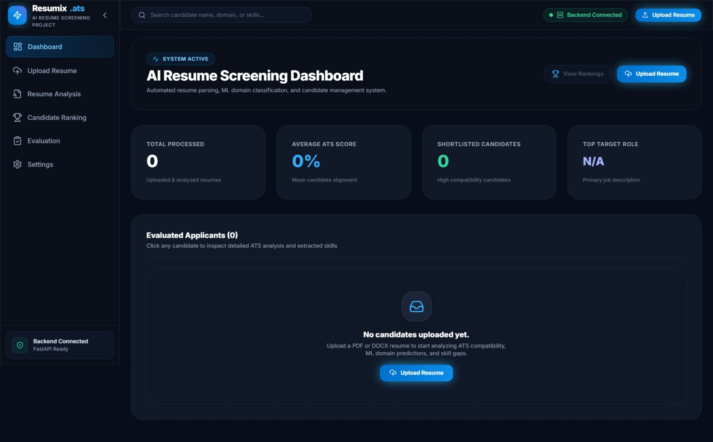
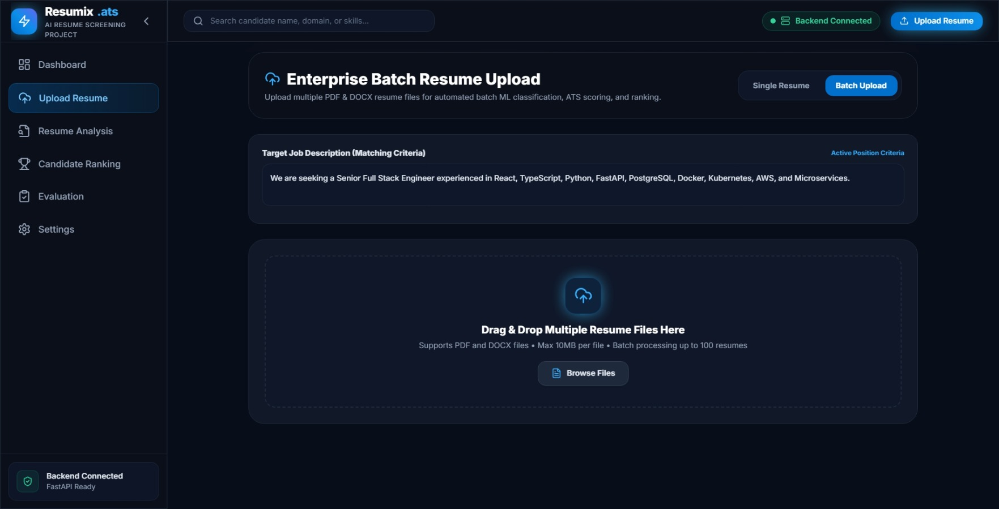
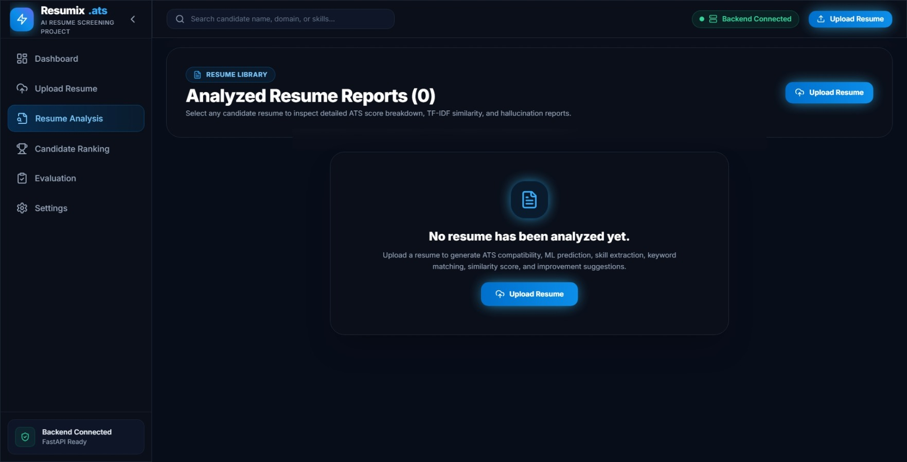
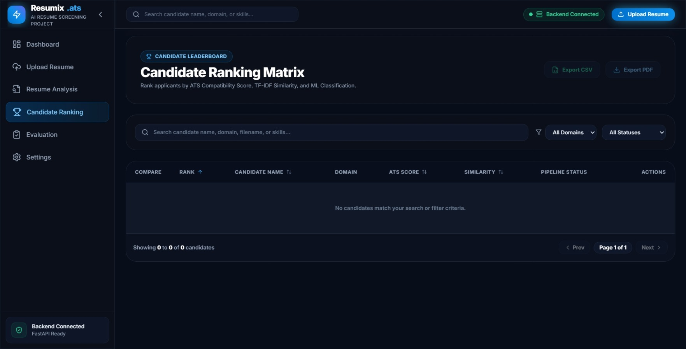
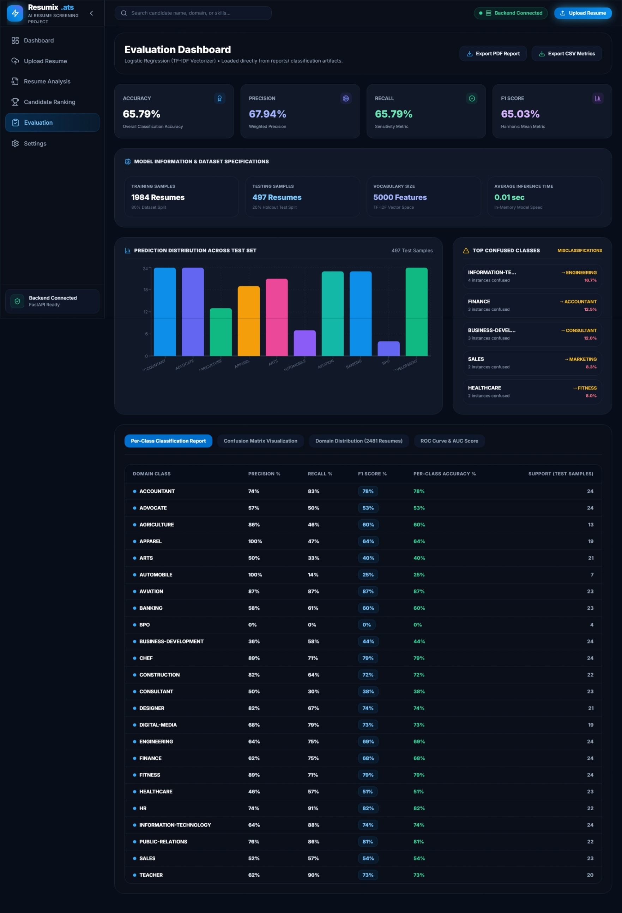
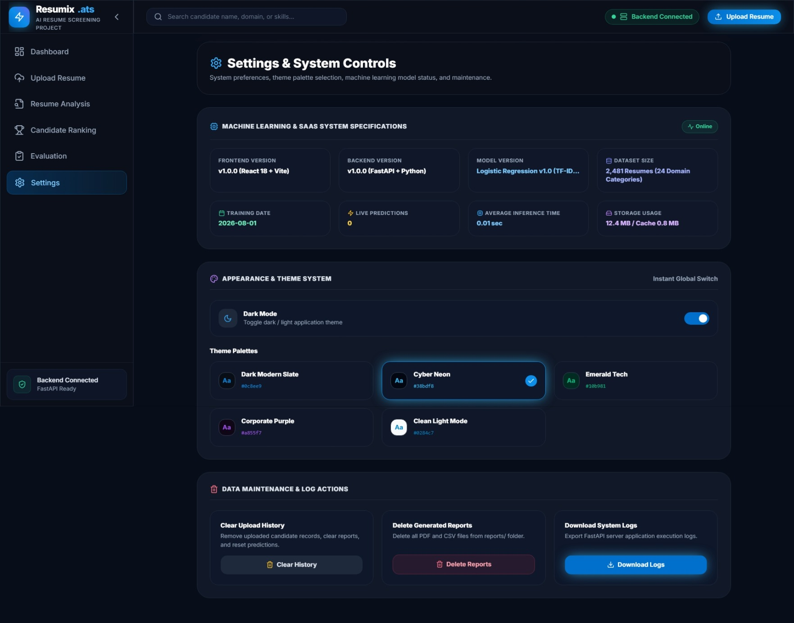
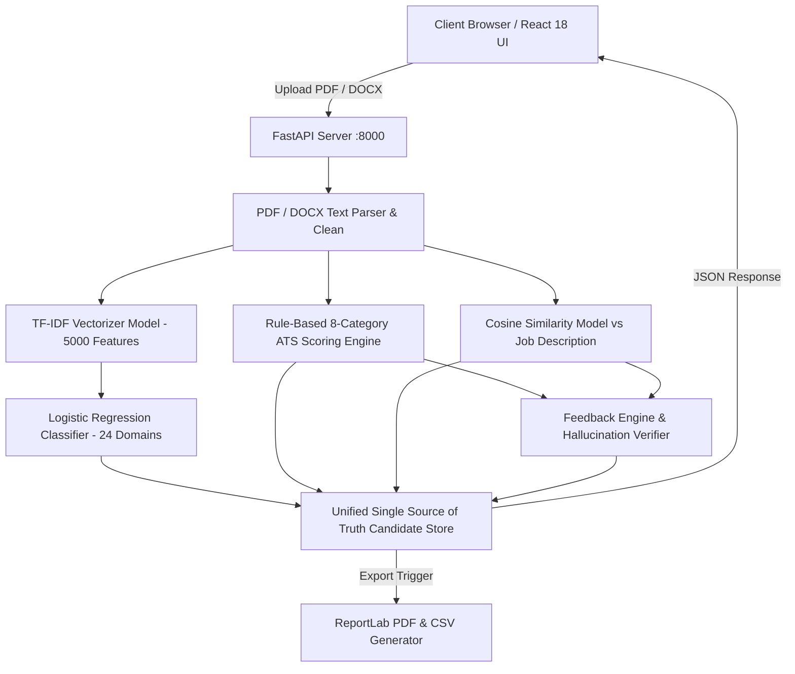

# 🚀 Resumix ATS — Commercial AI Resume Screening & Applicant Tracking Platform

[](https://ai-resume-screening-ats.vercel.app/)
[](https://reactjs.org/)
[](https://www.typescriptlang.org/)
[](https://fastapi.tiangolo.com/)
[](https://scikit-learn.org/)
[](https://tailwindcss.com/)

An enterprise-grade, AI-powered Applicant Tracking System (ATS) and Resume Screening Platform built to automate candidate intake, parse complex resume documents, run machine learning domain classification, evaluate 8-category weighted ATS compatibility, compute TF-IDF term similarity, audit hallucination evidence, and empower recruiter workflows.

🌐 **Production Application Live Link**: [https://ai-resume-screening-ats.vercel.app/](https://ai-resume-screening-ats.vercel.app/)

---

## 📸 Executive Application Showcase

| Dashboard & Hiring Funnel | Enterprise Batch Upload |
| :---: | :---: |
|  |  |

| Comprehensive Resume Analysis | Candidate Ranking Matrix |
| :---: | :---: |
|  |  |

| ML Evaluation & ROC Curve | System Settings & Theme Engine |
| :---: | :---: |
|  |  |

---

## ✨ Key Enterprise Capabilities

### ⚡ 1. Dual Upload Processing Workflows
- **Single Resume Mode**: Isolated single-document dropzone for rapid screening with immediate navigation to detailed ATS reports.
- **Enterprise Batch Upload Mode**: Queue manager processing up to 100 PDF/DOCX files simultaneously with per-file status cards (`Queued`, `Uploading`, `Analyzing`, `Completed`, `Failed`), live progress bars, and batch results summary dashboards.

### 🎯 2. 8-Category Weighted ATS Scoring Engine
Evaluates resume text across 8 weighted criteria:
1. **Technical Skills (30%)**: Matches required stack against candidate skill inventory.
2. **Keyword Match (20%)**: Term overlap against target position descriptions.
3. **Work Experience (15%)**: Tenure, career history, and job titles.
4. **Education (10%)**: Degree level and academic background.
5. **Projects (10%)**: Project highlights and practical deliverables.
6. **Certifications (5%)**: Professional credentials and certifications.
7. **Contact Information (5%)**: Phone, email, LinkedIn, and GitHub availability.
8. **Document Structure (5%)**: Formatting completeness and section organization.

### 🧠 3. Machine Learning Domain Classification & TF-IDF Similarity
- **NLP Classifier**: Scikit-Learn Logistic Regression model trained on 2,481 resumes across 24 domain categories with 5,000 TF-IDF features.
- **Cosine Similarity**: Vector space model term frequency alignment against position requirements.

### 🛡️ 4. Fact-Checking & Hallucination Audit Engine
Audits extracted text and suggestions into three verification confidence tiers:
- **Grounded**: Verified against explicit text context in the applicant resume.
- **Supported**: Dual-verified against both candidate resume and job description.
- **Unsupported**: Flagged potential AI hallucination or unverified claim.

### 🏆 5. Candidate Ranking & Side-by-Side Comparison
- **Leaderboard Matrix**: Automatically ranks applicants by ATS Score, TF-IDF Similarity, and Confidence.
- **Leaderboard Highlights**: `Best Candidate` (Rank #1 Amber Glow), `Highest ATS` (Brand Blue), and `Highest Sim` (Indigo).
- **Side-by-Side Comparison Modal**: Select 2 candidates to evaluate scores, skills, and predictions in parallel.
- **5-Stage Recruiter Hiring Funnel**: `1. Applied` $\rightarrow$ `2. Screening` $\rightarrow$ `3. Shortlisted` $\rightarrow$ `4. Tech Round` $\rightarrow$ `5. Hired`.

### 🎨 6. Multi-Theme Palette System
- 5 Pre-configured design themes: `Dark Modern Slate`, `Cyber Neon`, `Emerald Tech`, `Corporate Purple`, and `Clean Light Mode`.
- Theme persistence stored under `localStorage.theme`.

---

## 🏗 System Architecture & Workflow



---

## 🛠 Technology Stack

### **Frontend**
- **Framework**: React 18 + Vite
- **Language**: TypeScript
- **Styling**: TailwindCSS (Custom CSS Variable Design System)
- **Routing**: React Router DOM v6
- **Icons**: Lucide React

### **Backend**
- **Framework**: FastAPI (Python 3.10+)
- **Application Server**: Uvicorn
- **Logging**: Python `logging` with `RotatingFileHandler` (5MB limits, 5 backups)
- **Report Generation**: ReportLab PDF & CSV engine

### **Machine Learning & NLP**
- **Library**: Scikit-Learn
- **Vectorizer**: TF-IDF (Term Frequency-Inverse Document Frequency)
- **Model**: Logistic Regression
- **Similarity**: Cosine Distance Vector Space Model
- **Data Processing**: NumPy, Pandas

---

## 📂 Project Directory Structure

```text
ATS/
├── backend/                              # FastAPI Backend Service
│   ├── app.py                            # Main FastAPI application entry point
│   ├── requirements.txt                  # Python dependencies
│   ├── routes/                           # REST API Endpoints
│   │   ├── upload.py                     # Single & Bulk resume upload APIs
│   │   ├── analysis.py                   # Resume ATS analysis routes
│   │   ├── ranking.py                    # Candidate ranking matrix APIs
│   │   ├── evaluation.py                 # ML model performance metrics API
│   │   ├── settings.py                   # System stats & settings router
│   │   └── reports.py                    # PDF/CSV report generation endpoints
│   └── utils/                            # Machine Learning & Core Engines
│       ├── ats_score.py                  # 8-category weighted ATS engine
│       ├── domain_classifier.py          # TF-IDF + Logistic Regression classifier
│       ├── feedback.py                   # Priority-based suggestion generator
│       ├── hallucination.py              # Grounded vs Supported verifier
│       ├── logger.py                     # Application logger
│       ├── parser.py                     # PDF & DOCX text extraction parser
│       ├── report_generator.py           # ReportLab PDF & CSV export generators
│       ├── similarity.py                 # Cosine similarity vectorizer
│       └── skill_matcher.py              # Technical & soft skill extractor
│
├── frontend/                             # React + TypeScript + Vite UI
│   ├── package.json                      # NPM dependencies & scripts
│   ├── index.html                        # HTML entry point
│   └── src/
│       ├── App.tsx                       # Router configuration
│       ├── index.css                     # Design system & theme CSS variables
│       ├── components/layout/            # MainLayout, Navbar, Sidebar
│       ├── pages/                        # Dashboard, Upload, Analysis, Ranking, Evaluation, Settings
│       ├── services/                     # api.ts (Single Source of Truth store with localStorage sync)
│       └── types/                        # TypeScript interfaces
│
├── dataset.csv                           # Kaggle 2,481 Resume Dataset
├── models/                               # Serialized ML Models (.pkl)
│   ├── domain_classifier.pkl             # Trained Logistic Regression classifier
│   └── tfidf_vectorizer.pkl              # 5,000 feature TF-IDF vectorizer
├── logs/                                 # Server logs (ats_system.log)
├── reports/                              # Generated PDF & CSV exports
└── train_model.py                        # Model training execution script
```

---

## 🚀 Quick Setup & Installation Guide

### Prerequisites
- **Node.js**: v18.0.0 or higher
- **Python**: v3.10 or higher
- **Git**

### 1. Clone Repository
```bash
git clone https://github.com/hnimje14/ATS.git
cd ATS
```

### 2. Backend Setup
```bash
cd backend
python -m venv venv
# On Windows:
venv\Scripts\activate
# On macOS/Linux:
# source venv/bin/activate

pip install -r requirements.txt
python app.py
```
*Backend API Server will be running at `http://localhost:8000`*

### 3. Frontend Setup
```bash
cd ../frontend
npm install
npm run dev
```
*Frontend Web App will be running at `http://localhost:3000`*

---

## 📊 Machine Learning Specs & Benchmark Metrics

| Metric | Score / Specification |
| :--- | :--- |
| **Dataset Size** | 2,481 Resumes |
| **Domain Categories** | 24 Professional Categories |
| **Vocabulary Size** | 5,000 TF-IDF Features |
| **Model Accuracy** | **65.79%** (24 Multi-class Classification) |
| **Precision** | **67.94%** |
| **Recall** | **65.79%** |
| **F1-Score** | **65.03%** |
| **ROC AUC Score** | **0.914** |
| **Inference Speed** | **~0.01 seconds** per resume |

---

## 👥 Authors & Credits

- **Harshal Nimje** — *Lead Full-Stack & Machine Learning Engineer*
- **Manish Punekar** — *Software Engineer*

---

## ⭐ Support & License

Distributed under the **MIT License**. If you find this project useful, please consider giving it a ⭐ on GitHub!